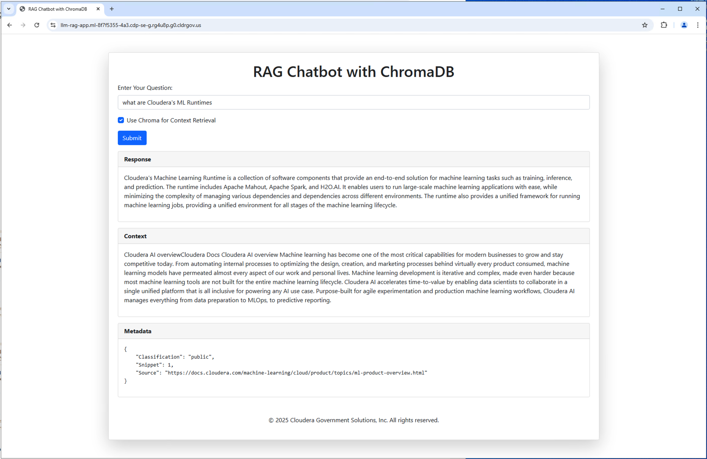
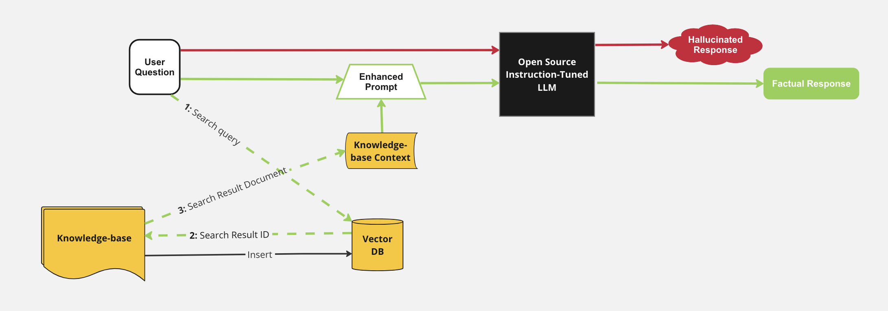

# LLM Chatbot Augmented with Enterprise Data (Gov Edition)

This repository demonstrates how to use an open source pre-trained instruction-following LLM (Large Language Model) to build a Chatbot web application. The responses of the LLM are enhanced by giving it context from an internal knowledge base. This context is retrieved by using Chroma, an open source Vector Database, to do semantic search. This AMP was built specifically for supporting the CDP for Government (FedRAMP) environment and uses FIPS compliant python libraries to ensure seamless AMP build and execution.



All the components of the application (knowledge base, context retrieval, prompt enhancement LLM) are running within CML. This application does not call any external model APIs nor require any additional training of an LLM. The knowledge base provided in this repository is a slice of the Cloudera Machine Learning documentation.

> **IMPORTANT**: Please read the following before proceeding.  By configuring and launching this AMP, you will cause `h2oai/h2ogpt-oig-oasst1-512-6.9b`, which is a third party large language model (LLM), to be downloaded and installed into your environment from the third party’s website.  Please see `https://huggingface.co/h2oai/h2ogpt-oig-oasst1-512-6.9b` for more information about the LLM, including the applicable license terms.  If you do not wish to download and install `h2oai/h2ogpt-oig-oasst1-512-6.9b`, do not deploy this repository.  By deploying this repository, you acknowledge the foregoing statement and agree that Cloudera is not responsible or liable in any way for `h2oai/h2ogpt-oig-oasst1-512-6.9b`. Author: Cloudera Inc.

## Table of Contents 
#### README
* [Enhancing Chatbot with Enterprise Context to reduce hallucination](#enhancing-chatbot-with-enterprise-context-to-reduce-hallucination)
  * [Retrieval Augmented Generation (RAG) Architecture](#retrieval-augmented-generation--rag--architecture)
* [Requirements](#requirements)
* [Project Structure](#project-structure)
* [Implementation](#implementation)
* [Technologies Used](#technologies-used)


## Enhancing Chatbot with Enterprise Context to reduce hallucination

When a user question is directly sent to the open-source LLM, there is increased potential for halliucinated responses based on the generic dataset the LLM was trained on. By enhancing the user input with context retrieved from a knowledge base, the LLM can more readily generate a response with factual content. This is a form of Retrieval Augmented Generation.

For more detailed description of architectures like this and how it can enhance NLP tasks see this paper: [Retrieval-Augmented Generation for Knowledge-Intensive NLP Tasks
](https://arxiv.org/abs/2005.11401)

### Retrieval Augmented Generation (RAG) Architecture
- Knowledge base Ingest into Vector Database
  - Given a local directory of proprietary data files (in this example we just use HTML links from Cloudera's ML documentation but you will need to update these with your own or add your own txt files to the `5_job-populate-vector-db/data` folder)
  - Generate embeddings with an open sourced pretrained model for each of those files
  - Store those embeddings along with document IDs in a Vector Database to enable semantic search
- Augmenting User Question with Additional Context from Knowledge Base
  - Given user question, search the Vector Database for documents that are semantically closest based on embeddings
  - Retrieve context based on document IDs and embeddings returned in the search response
- Submit Enhanced prompt to LLM to generate a factual response
  - Create a prompt including the retrieved context and the user question
  - Return the LLM response in a web application

## Requirements
#### CML Instance Types
- A GPU instance is required to perform inference on the LLM
  - [CML Documentation: GPUs](https://docs.cloudera.com/machine-learning/cloud/gpu/topics/ml-gpu.html)
- A CUDA 5.0+ capable GPU instance type is recommended
  - The torch libraries in this AMP require a GPU with CUDA compute capability 5.0 or higher. (i.e. nVidia V100, A100, T4 GPUs)

#### Resource Requirements
This AMP creates the following workloads with resource requirements:
- CML Session: `2 CPU, 1 GPU, 16GB MEM` *(not required after AMP is fully deployed)*
- CML Jobs: `2 CPU, 8GB MEM`
- CML Application: `2 CPU, 1 GPU, 16GB MEM`

#### External Resources
This AMP requires pip packages and models from huggingface. Depending on your CML networking setup, you may need to whitelist some domains:
- docs.cloudera.com
- developer.download.nvidia.com
- download.pytorch.org
- pypi.python.org
- pypi.org
- pythonhosted.org
- huggingface.co

## Project Structure
### Folder Structure

The project is organized with the following folder structure:
```
.
├── 0_session-install-cuda/          # Script for install NVIDIA CUDA Toolkit
├── 1_session-install-pytorch/       # Install LLM Python library dependencies
├── 2_session-install-dependencies/  # Installs the latest GPU accelerated PyTorch libraries
├── 3_session-make-chroma-venv/      # Creates a virtual environment for generating embeddings to load to Chroma
├── 4_job-download-models/           # Setup scripts for downloading pre-trained models
├── 5_job-populate-vectordb/         # Setup scripts for initializing and populating a vector database with context documents
├── 6_app/                           # Backend scripts for launching chat webapp and making requests to locally running pre-trained models
├── utils/                           # Python modules for functions used for interacting with pre-trained models
├── images/
├── README.md
└── LICENSE.txt
```

## Implementation
### `data/`
This directory stores all the individual sample documents that are used for context retrieval in the chatbot application
- Sourced from [CML](https://docs.cloudera.com/machine-learning/cloud/index.html)
- Links can be updated in `5_job-populate-vectordb/html-links.txt`

### `0_session-install-cuda`
- Installs NVIDIA's CUDA Toolkit and links the relevant environment variables (uses `cuda_12.6.3_560.35.05_linux` release)

### `1_session-install-pytorch`
- Installs the latest GPU accelerated PyTorch libraries

### `2_session-install-dependencies`
- Install python dependencies specified in `2_session-install-dependencies/requirements.txt`
- Certain python libraries have been selected to align with FIPS cryptography and strong encryption. As an example, at the time of this writing,  `tokenizers==0.13.0` is the lastest version of this library not using weak `md5` encryption. Attempts to install later versions may succeed but application will fail to execute since the UBI will know to kill this process.

### `3_session-make-chroma-venv`
Creates a virtual environment for generating embeddings to load to Chroma Vector DB. 
- Must be leveraged due to the hard dependencies on certain python libraries by the LLM application
- Executing with the virtual environment is done via wrapper files with the syntax `exec-*`

### `4_job-download-models`
Definition of the job **Download Models** 
- Directly download specified models from huggingface repositories
- These are pulled to new directories models/llm-model and models/embedding-model

### `5_job-populate-vectordb`
Definition of the job **Download / Convert HTMLs to Text**
Definition of the job **Populate Vector DB with documents embeddings**
- Download and convert to TXT all HTMLs in `5_job-populate-vectordb/html-links.txt` (examples provided)
- Converted files will be stored in a `5_job-populate-vectordb/data/*` subdirectory nested folder structure.
- Create a collection for the Chroma vector database and set database to be persisted in new directory chroma-data/
- Generate embeddings for each document in `5_job-populate-vectordb/data/*` (additional metadata tags can be added/removed based on business use case in `5_job-populate-vectordb/load-to-chromadb.py`)
- The embeddings vector for each document is inserted into the vector database
- Stop the vector database

### `6_app`
Definition of the application `LLM RAG Chatbot`
- Start the Chroma vector database using persisted database data in chroma-data/
- Load locally persisted pre-trained models from models/llm-model and models/embedding-model 
- Start flask web interface 
- The chat interface performs both retrieval-augmented LLM generation and regular LLM generation for bot responses.

## Technologies Used
#### Open-Source Models and Utilities
- [all-MiniLM-L12-v2](https://huggingface.co/sentence-transformers/all-MiniLM-L12-v2/tree/9e16800aed25dbd1a96dfa6949c68c4d81d5dded)
     - Vector Embeddings Generation Model
- [h2ogpt-oig-oasst1-512-6.9b](https://huggingface.co/h2oai/h2ogpt-oig-oasst1-512-6.9b/tree/4e336d947ee37d99f2af735d11c4a863c74f8541)
   - Instruction-following Large Language Model
- [Hugging Face transformers library](https://pypi.org/project/transformers/)
#### Vector Database
- [Chroma](https://pypi.org/project/chromadb/)
#### Chat Interface
- [Flask](https://flask.palletprojects.com/en/stable)
- [Jinja2](https://jinja.palletprojects.com/en/stable)

## Deploying on CML
There are two ways to launch this prototype on CML:

1. **From Prototype Catalog** - Navigate to the Prototype Catalog on a CML workspace, select the "LLM Chatbot Augmented with Enterprise Data" tile, click "Launch as Project", click "Configure Project"
2. **As ML Prototype** - In a CML workspace, click "New Project", add a Project Name, select "ML Prototype" as the Initial Setup option, copy in the [repo URL](https://github.com/cloudera/CML_GOV_AMP_LLM_Chatbot_Augmented_with_Enterprise_Data), click "Create Project", click "Configure Project"
